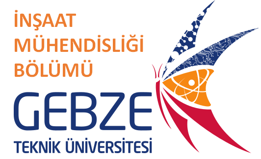

### "GTU Department of Civil Engineering - Graduate Program"
## "EQE511 FINITE ELEMENT METHODS AND COMPUTER APPLICATIONS"
#### Lecturer: _Dr. Ahmet Anıl Dindar (adindar@gtu.edu.tr)_
#### Period: _2019-Fall_

---

#### Table of the Content of the Course

|Week|Date|Topic|Tasks|
|:---: |:---:|:---:|:---:|:---:|
| 1 | 11.2 | Introduction to finite elements method , Review of matrix theory and mathematical concepts|-|
| 2 | 18.2 | Global and local coordinate systems, Stiffness and local - global transformation matrix for truss element|-|
| 3 | 25.2 | Constructing and solving 2D truss system using Python | HW1| 
| 4 |  4.3 | Stiffness and local - global transformation matrix for 2D beam and frame elements | - |
| 5 | 11.3 | Constructing and solving 2D frame system using Python | HW2|
| 6 | 18.3 | Stiffness and local - global transformation matrix for 3D frame elements| -|
| 7 | 25.3 | Introduction to two dimensional elements (Plane stress, Plan strain), Shape functions numerical integration| HW3|
| 8 |  1.4 | Mid-term exam | Term Project Starts|
| 9 |  8.4 | Constructing and solving plane stress and plane strain systems using Python | - |
|10 | 15.4 | Formulation for plate, membrane and shell elements |  HW4 |
|11 | 22.4 | Formulation for three dimensional solid elements |- |
|12 | 29.4 | Dynamic time history and dynamic modal analyses of structure| HW5| 
|13 |  6.5 | Case Study 1 (Hackathon)| -|
|14 | 13.5 | Case Study 2 (Hackathon)| -|
 ---
 
 